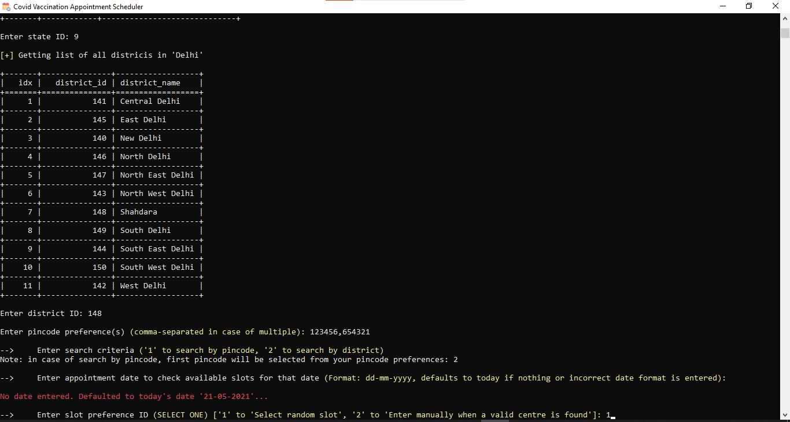
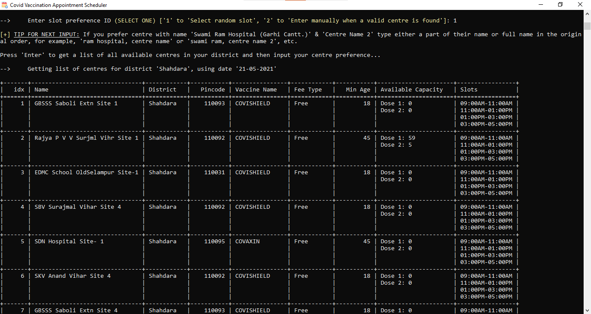
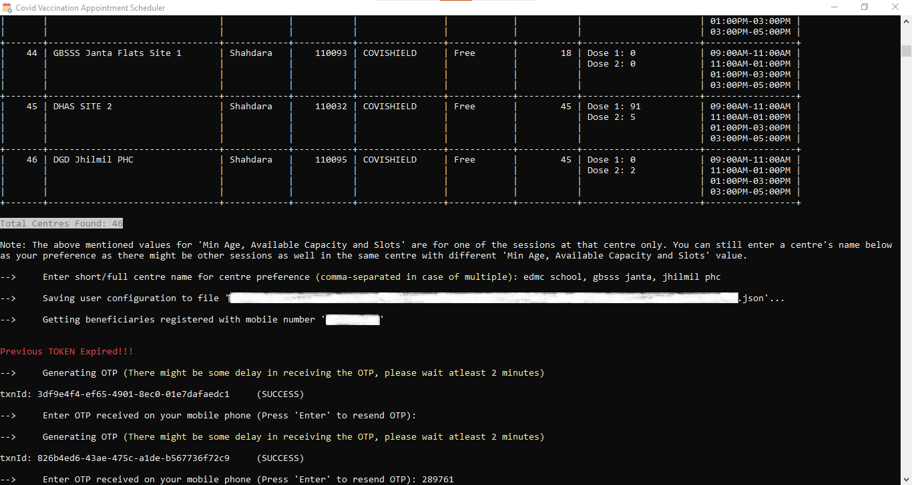
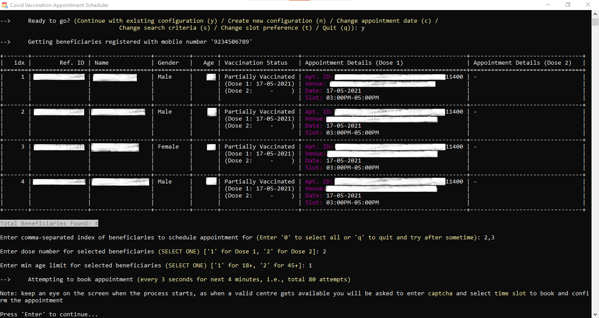
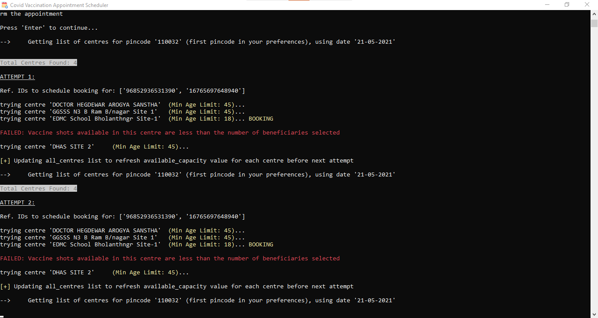

<!--
*** Thanks for checking out this project. If you have a suggestion
*** that would make this better, please fork the repo and create a pull request
*** or simply open an issue with the tag "enhancement".
-->


<!-- PROJECT SHIELDS -->
<!--
*** I'm using markdown "reference style" links for readability.
*** Reference links are enclosed in brackets [ ] instead of parentheses ( ).
*** See the bottom of this document for the declaration of the reference variables
*** for contributors-url, forks-url, etc. This is an optional, concise syntax you may use.
*** https://www.markdownguide.org/basic-syntax/#reference-style-links
-->
[![Contributors][contributors-shield]][contributors-url]
[![Forks][forks-shield]][forks-url]
[![Stargazers][stars-shield]][stars-url]
[![Issues][issues-shield]][issues-url]


<!-- PROJECT LOGO -->
<br />
<p align="center">
	<a href="https://github.com/DivAgicha/CoWIN-Vaccine-Appointment-Booking">
		
	</a>
	<h3 align="center">CoWIN Vaccine Appointment Booking</h3>
	<p align="center">
		Script to automate COVID-19 vaccination slot booking on India's Co-WIN Platform
		<br />
		<a href="https://github.com/DivAgicha/CoWIN-Vaccine-Appointment-Booking"><strong>Explore the docs »</strong></a>
		<br />
		<br />
		<a href="mailto:div.agicha@gmail.com">Report Bug</a>
		·
		<a href="mailto:div.agicha@gmail.com">Request Feature</a>
</p>


<!-- ABOUT -->
## About The Project

As it's a difficult task to schedule an appointment for CoVid-Vaccine with only limited slots available for each day, this script automates the whole process of checking availability of slots every 3 seconds and also books it as soon as it becomes available. Just do a **one-time configuration** by entering your preferences initially **(pincode, district, centre preference, slot timing, etc.)** and let this script do the rest.


### Customizable Options in the Program

1. State ID / Name
2. District ID / Name
3. Pincode(s) in the district
4. Search Criteria *(whether to search centres by Pincode or District)*
5. Centre Preferences *(which centre to book among all the available centres)*
6. Slot Preference *(whether to select a random slot from among the available slots for a particular centre or ask the user to manually select the slot once a valid centre is found)*
7. Appointment Date *(date for which the centres have to be checked for availability and scheduling thereafter)*
8. Beneficiaries *(which beneficiaries to schedule appointment for, among all the registered benficiaries(max. 4) in the account)*
9. Dose Number *(which dose number (1 or 2) appointment to schedule. Must be same for all the selected beneficiaries)*
10. Min Age Limit *(minimum age limit of the selected beneficiaries. All selected beneficiaries must belong to the same minimum age group, either 18+ or 45+)*


### Screenshots
















<!-- PREREQUISITES -->
### Prerequisites

This project requires **Python (3.6 or higher)** to be installed on the user system.


<!-- INSTALLATION -->
### Installation

1. Install **Python (3.6 or higher)** and **Git CLI (OPTIONAL)** on the system by searching for respective setups for your operaing system on Google
2. Clone the repo
	```sh
	git clone https://github.com/DivAgicha/CoWIN-Vaccine-Appointment-Booking.git
	```	
3. Alternatively, if you don't have Git CLI you can directly download the project's zip file by clicking [here](https://github.com/DivAgicha/CoWIN-Vaccine-Appointment-Booking/archive/refs/heads/master.zip). Once downloaded, extract the contents of the zip file to desired location
4. Open shell / command-prompt and change the working directory to "CoWIN-Vaccine-Appointment-Booking"
	```sh
	cd "path_to_CoWIN-Vaccine-Appointment-Booking_directory"
	```
5. Install all the required python dependencies
	```sh
	pip install -r requirements.txt
	```
6. Run the script to enter your details and book a vaccination slot
	```sh
	python schedule_vaccination_appointment.py
	```


<!-- CONTRIBUTING -->
## Contributing

Contributions are what make the open source community such an amazing place to learn, inspire, and create. Any contributions you make are **greatly appreciated**.

1. Fork the Project
2. Create your Feature Branch (`git checkout -b feature/AmazingFeature`)
3. Commit your Changes (`git commit -m 'Add some AmazingFeature'`)
4. Push to the Branch (`git push origin feature/AmazingFeature`)
5. Open a Pull Request


<!-- CONTACT -->
## Contact

Name - Divyansh Agicha - [div.agicha@gmail.com](mailto:div.agicha@gmail.com)

Project Link: [https://github.com/DivAgicha/CoWIN-Vaccine-Appointment-Booking](https://github.com/DivAgicha/CoWIN-Vaccine-Appointment-Booking)


<!-- MARKDOWN LINKS & IMAGES -->
<!-- https://www.markdownguide.org/basic-syntax/#reference-style-links -->
[contributors-shield]: https://img.shields.io/github/contributors/DivAgicha/CoWIN-Vaccine-Appointment-Booking.svg?style=for-the-badge
[contributors-url]: https://github.com/DivAgicha/CoWIN-Vaccine-Appointment-Booking/graphs/contributors
[forks-shield]: https://img.shields.io/github/forks/DivAgicha/CoWIN-Vaccine-Appointment-Booking.svg?style=for-the-badge
[forks-url]: https://github.com/DivAgicha/CoWIN-Vaccine-Appointment-Booking/network/members
[stars-shield]: https://img.shields.io/github/stars/DivAgicha/CoWIN-Vaccine-Appointment-Booking.svg?style=for-the-badge
[stars-url]: https://github.com/DivAgicha/CoWIN-Vaccine-Appointment-Booking/stargazers
[issues-shield]: https://img.shields.io/github/issues/DivAgicha/CoWIN-Vaccine-Appointment-Booking.svg?style=for-the-badge
[issues-url]: https://github.com/DivAgicha/CoWIN-Vaccine-Appointment-Booking/issues
